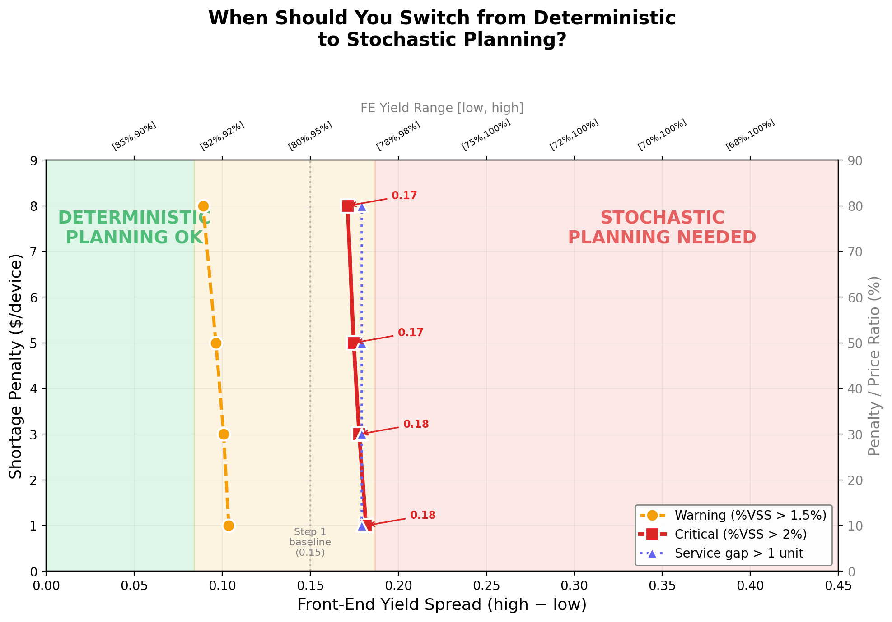
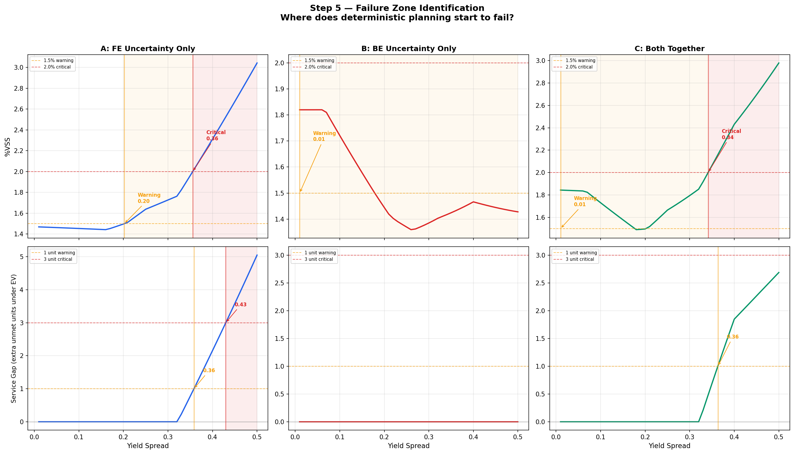

# When Does Stochastic Planning Pay Off?

### Yield-uncertainty thresholds for semiconductor supply-chain optimization

Code, experiments, results, and complete solver logs for:

> S. Elsaady and J. Zhang, "When Does Stochastic Planning Pay Off? Yield
> Uncertainty Thresholds for Semiconductor Supply Chain Optimization,"
> submitted to *IEEE Transactions on Semiconductor Manufacturing*, 2026.

---

## The question, and the answer

Stochastic (uncertainty-aware) planning is known to beat deterministic
(average-yield) planning under yield uncertainty - but *by how much*, and *when
is it worth the trouble?* Prior work shows the value of the stochastic solution
(VSS) grows with uncertainty without saying where it starts to matter. This
study locates that line.

**Headline result.** For a single-product, single-period Front-End / Die-Bank /
Back-End supply chain, deterministic planning loses **more than 2% of expected
profit once the Front-End yield spread exceeds ≈ 0.17–0.18 (half-range)**.
Equivalently, once worst-case FE yield drops below ≈ 70%. Below that line,
average-yield planning is good enough. The threshold is **robust**: it barely
moves (0.17 ↔ 0.18) as the shortage penalty ranges from 10% to 80% of price.



*The practitioner deliverable. Read off your FE yield spread (x-axis) and your
shortage-penalty-to-price ratio (right axis): green = deterministic is fine,
red = stochastic planning is worth it. The boundary sits at a spread of
0.17–0.18 and hardly shifts with cost structure.*

---

## Two findings that change the recommendation

**1. Front-End uncertainty drives the choice; Back-End uncertainty does not.**
VSS (the profit gap between the two planning approaches) grows with FE spread
because recourse (reallocating wafer starts) is available *after* FE yield is
observed. BE yield is revealed at the last stage with no recourse, so it hurts
both approaches equally and never triggers the switch. Practically: for FE
variability, upgrade your *planning*; for BE variability, upgrade your *quality*.

**2. Service quality fails as a cliff, not a slope.** Fill rate is stable right
up to the threshold, then degrades fast. Service metrics give *no early
warning* - which is exactly why a spread-based rule is useful.



*Where deterministic planning breaks down. Sweeping FE-only (left), BE-only
(middle), and both (right). %VSS (top) crosses the 2% "critical" line for FE at
a full-range spread ≈ 0.36 (half-range ≈ 0.18); BE-only never crosses it. The
service gap (bottom) is flat, then cliffs.*

---

## Results at a glance - every number regenerates

All values below were re-derived from a clean checkout with `PuLP` + `CBC`
during preparation of this repository; the byte-identical ones are marked.

| Result | Value | Produced by |
|---|---|---|
| Baseline RP profit | **$6,380.66** | `src/step1_reproduce_vss.py` |
| Baseline EEV profit | **$6,288.50** | `src/step1_reproduce_vss.py` |
| Baseline VSS ( = RP − EEV ) | **$92.16 (1.44%)** | `src/step1_reproduce_vss.py` - CSV reproduces identically |
| Calibrated VSS (FE mean 0.90) | **$92.33** | `experiments/calib_sensitivity.py` |
| Critical FE half-range threshold | **0.178** (baseline) → **0.171** (80% penalty) | `src/step5_failure_points.py`, `src/step6_robustness.py` |
| Threshold vs. FE mean (0.85 / 0.875 / 0.90) | half-range **0.153 / 0.178 / 0.203** | `experiments/threshold_vs_mean.py` |
| Continuous-Beta yield crossing | %VSS > 2% near spread ≈ 0.26 | `experiments/beta_experiment.py` - `beta_results.csv` reproduces identically |
| Worst-case FE yield recast | ≈ **70%** ( = 0.875 − 0.178 ) | derived from the threshold |

Each instance is a mixed-integer program solved to **proven optimality by CBC
2.10.3 via PuLP in ≤ 0.01 CPU s**. `logs/` holds the raw CBC output for all
**1,050** Step 5–6 solves (450 + 600), each ending in
`Result - Optimal solution found`.

---

## How the study works - seven controlled steps

The model is a three-stage stochastic program (RP) versus its expected-value
counterpart (EEV); **VSS = RP − EEV** following Escudero et al. (2007), on the
FE/Die-Bank/BE structure of Rashidi et al. (SSRN 4655409). One knob (yield
uncertainty) is varied while every other parameter is frozen.

| Step | What it does | Experiments | Output |
|---|---|---|---|
| 1 | Reproduce & validate the baseline VSS | 4 | `results/Step1/` |
| 2 | Freeze the model on a 7×7 yield-spread grid | 49 | `results/Step2/` |
| 3 | Ramp FE / BE / both uncertainty independently | 45 | `results/Step3/` |
| 4 | Compare planning outcomes (profit, service, allocation) | 45 | `results/Step4/` |
| 5 | Locate precise failure thresholds (50 levels × 3, 5 criteria) | 150 | `results/Step5/` |
| 6 | Test threshold robustness across 4 cost structures | 200 | `results/Step6/` |
| 7 | Synthesize the decision rule, map, and lookup table | - | `results/Step7/` |
| | **Total** | **493** | |

A step-by-step walkthrough of each result, with all figures, is in
**[`docs/RESULTS.md`](docs/RESULTS.md)**.

---

## Reproduce it

```bash
pip install -r requirements.txt   # Python 3.10+; PuLP ships with the CBC solver
./reproduce.sh
```

`reproduce.sh` runs the baseline, calibration, mean-yield, and continuous-Beta
experiments and prints the expected numbers next to each (a few minutes on a
laptop). It puts `src/` on `PYTHONPATH` for you, so the experiment scripts can
import the core model. To run the full Step 2–7 sweep, invoke the `src/stepN_*`
scripts individually (also listed at the end of `reproduce.sh`).

To reproduce a single headline number:

```bash
python src/step1_reproduce_vss.py            # -> RP $6,380.66 / EEV $6,288.50 / VSS $92.16
PYTHONPATH=src python src/step5_failure_points.py   # -> results/Step5/step5_thresholds.csv
```

---

## Repository layout

```
src/            Seven-step pipeline. step2_freeze_model.py is the core model
                (FrozenInstance, run_experiment, solve_rp, solve_rp_fixed);
                step1_reproduce_vss.py is a standalone baseline reproduction.
experiments/    Revision experiments - published-data calibration, threshold-vs-mean,
                continuous Beta yield (+ beta_results.csv), and figure regeneration.
results/        Per-step CSVs, summary reports, and figures for Steps 1–7,
                including Step7/step7_decision_table.csv (the decision lookup table).
logs/           Complete CBC solver logs - every solve "Result - Optimal solution found".
docs/           RESULTS.md walkthrough, yield-calibration sources, sensitivity note.
reproduce.sh    One-command reproduction of the headline numbers.
```

---

## Calibration & honesty notes

- Yield parameters are grounded in published figures; sources are listed in
  [`docs/Yield_Data_Sources.md`](docs/Yield_Data_Sources.md) (each verified to
  exist; two unverifiable URLs from an early draft were removed and were never
  cited in the manuscript).
- The threshold is reported as a **conservative upper bound**: this is the
  simplest instance class (single product, single period), and more complex
  settings are expected to lower the threshold, not raise it.

## Citation

```bibtex
@article{elsaady2026stochastic,
  author  = {Elsaady, Saif and Zhang, Jeff},
  title   = {When Does Stochastic Planning Pay Off? Yield Uncertainty
             Thresholds for Semiconductor Supply Chain Optimization},
  journal = {IEEE Transactions on Semiconductor Manufacturing (submitted)},
  year    = {2026}
}
```

## License

See [`LICENSE`](LICENSE).

## Revision experiments (journal round)

Two experiments added for the journal version, in `experiments/`:

- **Two-dimensional invariance check** (`joint_2d_sweep.py` → `results/JointSweep2D/`):
  sweeps FE mean × shortage penalty (20 cells) and records the worst-case FE
  yield at the %VSS>2% crossing. It stays within [0.671, 0.704] (mean 0.694),
  and 0.693–0.704 for FE mean ≥ 0.85 - the worst-case-70% rule holds across the grid.
- **Multi-product extension** (`multiproduct_model.py`, `multiproduct_sweep.py`
  → `results/MultiProduct/`): two device types ($12 and $8) sharing FE/BE
  capacity. Collapsing to one product reproduces the single-product baseline
  exactly (VSS $92.16, no formulation regression). The FE-spread threshold moves
  to 0.164 half-range (from 0.178, ~8% lower) while the worst-case FE yield stays
  near 0.70 - shared capacity lowers the threshold, confirming the single-product
  value as a conservative upper bound.
