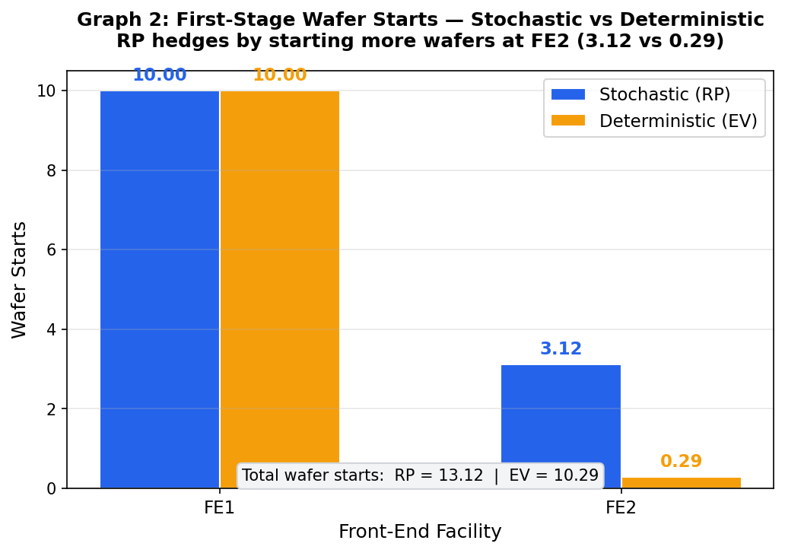
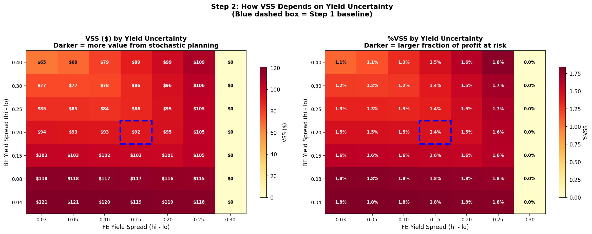
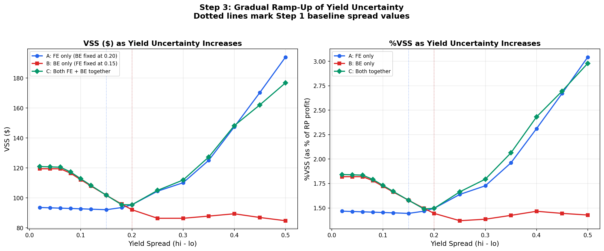
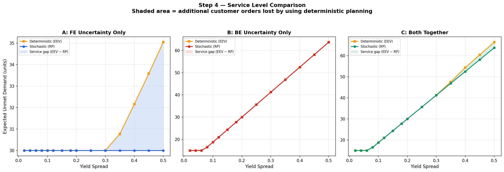
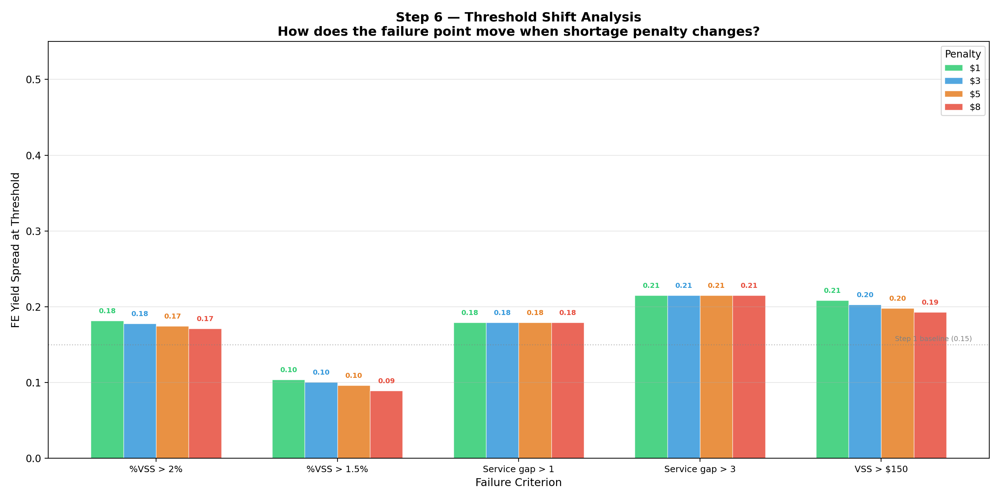

# Results walkthrough — the seven steps

A plain-language tour of what each step does and what it found. Every figure is
generated by the code in `src/` and `experiments/`; every number here is taken
from the committed summary reports in `results/`. Nothing is hand-entered.

The whole study varies **one knob — yield uncertainty — while freezing every
other parameter**, and measures the **Value of the Stochastic Solution**:

> **VSS = RP − EEV** — the expected profit of a proper stochastic plan (RP)
> minus the expected profit of the plan you'd get by optimizing for average
> yield and living with the consequences (EEV). VSS is what you lose by ignoring
> uncertainty.

---

## Step 1 — Reproduce and validate the baseline

Before varying anything, the model reproduces a known baseline: a stochastic
plan (RP) and its average-yield counterpart (EEV) on the FE/Die-Bank/BE chain.

- **RP = $6,380.66, EEV = $6,288.50, VSS = $92.16 (1.44%).**
- The stochastic plan hedges by loading the **secondary Front-End fab (FE2) with
  3.12 wafer starts vs only 0.29** under the deterministic plan — same total
  demand, different bet on where uncertainty will bite.

This step is a standalone script and reproduces the summary CSV
(`results/Step1/step1_summary_table.csv`) exactly.

*Hedging is visible in the first-stage decision: RP front-loads FE2.*

---

## Step 2 — Freeze the model and sweep a 7×7 grid

To make everything downstream a *controlled* experiment, the model structure is
frozen and yield uncertainty is swept over a 7×7 grid of FE and BE spreads
(**49 experiments**). This is the map on which later steps zoom in.

*VSS across the yield-spread grid. The gradient runs mostly along the FE axis —
the first hint that Front-End uncertainty, not Back-End, drives the value of
stochastic planning.*

---

## Step 3 — Ramp each uncertainty source independently

Three ramp-ups (**45 experiments**): FE-only, BE-only, and both together. Growing
FE spread steadily increases VSS; growing BE spread does not. The mechanism:
after FE yield is revealed there is **recourse** (reallocate wafer starts), so a
stochastic plan can exploit it. BE yield is revealed last, with nothing left to
adjust — so it hurts the stochastic and deterministic plans equally.

---

## Step 4 — Compare planning outcomes on every axis

The same 45 experiments, read out across profit, service, inventory, and
allocation:

- **Profit gap (VSS)** for FE-only uncertainty grows from **$92.16 (1.44%) to
  $193.99 (3.04%)** as spread widens to 0.50.
- **Service gap** (extra unmet demand under the deterministic plan) stays at zero
  and only **first exceeds 0.5 units at spread ≈ 0.35** — the beginning of the
  cliff.
- **Die-bank inventory is ≈ 0 for both plans.** With a **60:1 shortage-penalty-to-
  holding-cost ratio** ($3/unit short vs $0.05/unit held), the die bank acts as a
  pass-through, not a buffer. **Hedging happens through wafer allocation (extra
  FE2 starts), not inventory.**

*Service is identical between the two plans until uncertainty is large enough,
then the deterministic plan falls behind sharply.*

---

## Step 5 — Locate the precise failure thresholds

The core measurement. A fine 50-level spread sweep × 3 experiments
(**150 experiments**), with five failure criteria applied by linear interpolation:

- **FE-only, %VSS > 2% (critical):** triggers at FE **spread = 0.3556**
  (full range) → **half-range ≈ 0.178**.
- **FE-only, %VSS > 1.5% (warning):** triggers at spread = 0.2021 (half ≈ 0.101).
- **BE-only:** the 2% critical line is **never** crossed — confirming BE
  uncertainty does not drive the planning choice.
- Once the threshold is crossed, degradation is fast (e.g. %VSS climbs to 3.04%
  by spread 0.50), and the **service gap behaves as a cliff** — flat, then steep.

*Top row: %VSS vs spread with warning/critical lines. Bottom row: service gap.
FE (left) crosses both; BE (middle) crosses neither; both-together (right)
tracks FE.*

---

## Step 6 — Test robustness across cost structures

Is the threshold an artifact of one cost setting? The FE-only sweep is re-run
under four shortage-penalty levels (**200 experiments**): 10%, 30%, 50%, 80% of
selling price.

| Penalty / price | %VSS > 2% triggers at FE spread (half-range) |
|---|---|
| 10% | 0.1817 |
| 30% | 0.1778 |
| 50% | 0.1747 |
| 80% | 0.1712 |

The threshold moves **left** as the penalty rises (stochastic planning becomes
worth it sooner) but only within a **narrow 0.17–0.18 band** — it shifts by about
0.01 across an 8× change in penalty. The rule is broadly applicable, not tuned to
one cost scenario.

---

## Step 7 — Synthesize the decision rule

Steps 5–6 collapse into a single practitioner tool.

> **Primary rule:** if your Front-End yield spread exceeds **0.17** (half-range),
> invest in stochastic planning; otherwise average-yield planning is sufficient.
> Refined by penalty level, the threshold is 0.18 at a 10–30% penalty and 0.17 at
> 50–80%. Equivalently: **switch once worst-case FE yield falls below ≈ 70%.**

The decision map plots the boundary directly; the lookup table
(`results/Step7/step7_decision_table.csv`) lets a practitioner read off the
recommendation from two inputs — their FE yield variability and their shortage
cost ratio.

---

## Robustness beyond the two-point model

Two revision experiments (in `experiments/`) check that the threshold is not an
artifact of the simplified two-point (low/high) yield model:

- **Mean-yield sensitivity** (`threshold_vs_mean.py`): moving FE mean across
  0.85 / 0.875 / 0.90 shifts the half-range threshold to **0.153 / 0.178 / 0.203**
  — the rule tracks the mean predictably.
- **Continuous yield** (`beta_experiment.py`): replacing the two-point model with
  a continuous **Beta** yield distribution reproduces the same qualitative
  crossing (%VSS climbs through 2% near spread ≈ 0.26). Output reproduces
  `beta_results.csv` identically.

---

## What this is and is not

- **Is:** a quantitative, reproducible threshold for *this* instance class
  (single product, single period, fixed topology), offered as a **conservative
  upper bound** — richer models are expected to lower it.
- **Is not:** a universal constant. The limitations and the planned extensions
  (multi-product, empirical yields, demand as a third axis, multi-period) are
  listed in `results/Step7/step7_summary_report.txt`.

For solver-level evidence that every one of the 1,050 Step 5–6 solves reached
proven optimality, see [`../logs/`](../logs/).
